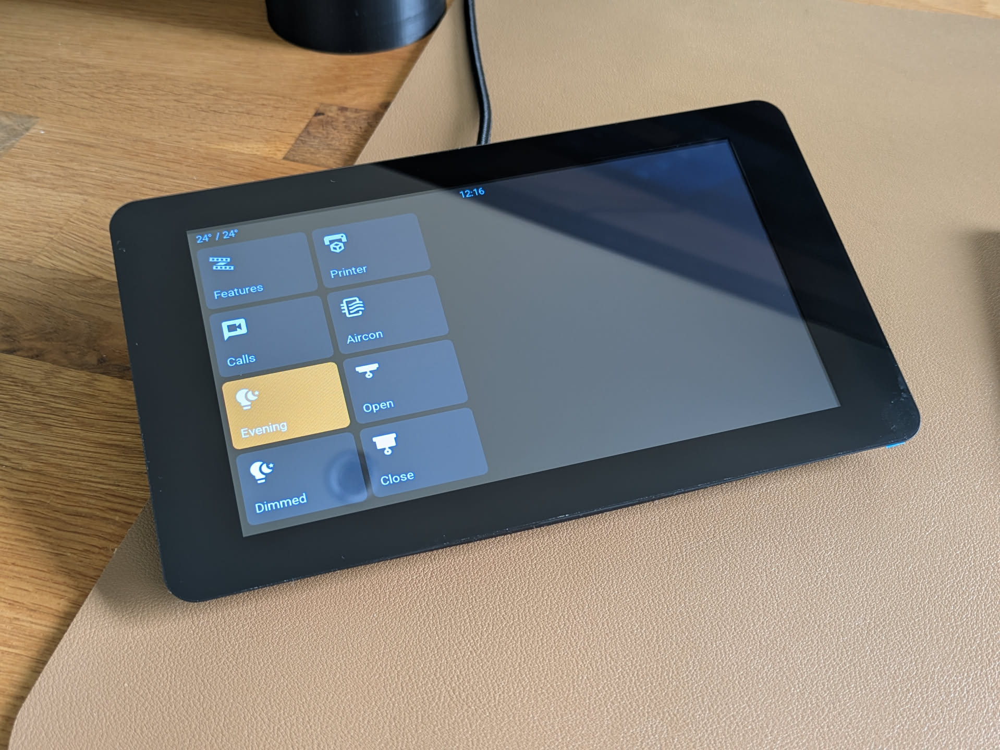

# ESPHome LVGL Configuration Repository

Welcome to my ESPHome LVGL configuration repository! This project provides a modular setup for ESP32-S3 touch LCD devices using the LVGL graphics library, designed specifically for home automation and sensor monitoring.



*7-inch touch LCD display running ESPHome with LVGL interface, showing home automation controls including temperature display, printer status, air conditioning controls, and various smart home features.*

## Purpose

This repository contains ESPHome configurations for creating beautiful, touch-enabled displays for home automation. The setup is organized into modular components that can be mixed and matched to create custom interfaces for different rooms and use cases.

## Features

- **ESP32-S3 Touch LCD Support**: Optimized for 7-inch touch LCD displays
- **Modular Design**: Organized components for easy customization
- **LVGL Interface**: Modern, responsive touch interface
- **Sensor Integration**: Built-in support for various sensors
- **Custom Themes**: Styled buttons and UI components
- **Network & Time**: Automatic network connectivity and time synchronization
- **Backlight Control**: Intelligent display brightness management


## Quick Start

### 1. Fork This Repository

**Important**: This repository contains configurations specific to my home setup. Please fork this repository and customize it for your own environment rather than using it directly.

### 2. Use the Template

Start with the template configuration file in esphome to build for your device:

```yaml
# Use template/office.yaml as your starting point
substitutions:
  name: "your-device-name"
  friendly_name: "Your Room Sensor"
  room: "Your Room"
```

### 3. Customize for Your Setup

The template pulls in modular components that you can customize:

- **Device Configuration**: `device/esp32-s3-touch-lcd-7.yaml`
- **Add-ons**: Time, backlight, and network configurations
- **Assets**: Custom fonts and icons
- **Theme**: Button styling and UI components
- **Sensors**: Room-specific sensor configurations
- **LVGL Interface**: Touch interface layout

### 4. Update WiFi and Secrets

Set your WiFi credentials in the Esphome secrets file:

```yaml
wifi_ssid: "Your_WiFi_SSID"
wifi_password: "Your_WiFi_Password"
```

## Repository Structure

```
├── addon/          # Optional add-on components
│   ├── backlight.yaml
│   ├── network.yaml
│   └── time.yaml
├── assets/         # Fonts and icons
│   ├── fonts.yaml
│   └── icons.yaml
├── device/         # Hardware-specific configurations
│   └── esp32-s3-touch-lcd-7.yaml
├── office/         # Room-specific configurations
│   ├── lvgl.yaml
│   └── sensors.yaml
├── template/       # Template for Esphome
│   └── office.yaml
└── theme/          # UI styling
    └── button.yaml
```

## Getting Started with ESPHome

1. **Install ESPHome**: Follow the [ESPHome installation guide](https://esphome.io/guides/installing_esphome.html)

2. **Copy the repo**: Use `template/office.yaml` as your starting configuration

3. **Customize**: Update the substitutions and modify components as needed for your specific setup

4. **Flash**: Compile and flash to your ESP32-S3 device

```bash
esphome compile your-config.yaml
esphome upload your-config.yaml
```

## Customization Tips

- **Sensors**: Modify `office/sensors.yaml` to match your sensor hardware
- **LVGL Interface**: Customize `office/lvgl.yaml` for your preferred layout
- **Styling**: Adjust `theme/button.yaml` for your visual preferences
- **Icons & Fonts**: Add your own assets in the `assets/` directory

## Contributing

Since this is my personal home setup, I encourage you to:

1. **Fork the repository** for your own use
2. **Share improvements** back to the community via pull requests
3. **Document your customizations** to help others

## Hardware Compatibility

This configuration is designed for:
- ESP32-S3 development boards
- 7-inch touch LCD displays
- Various sensors (temperature, humidity, etc.)

## Support

For ESPHome-specific issues, refer to the [ESPHome documentation](https://esphome.io/).

For LVGL-related questions, check the [LVGL documentation](https://docs.lvgl.io/).

## License

This project is provided as-is for educational and personal use. Please ensure you comply with all relevant licenses for ESPHome, LVGL, and any other components used.

---

**Remember**: This repository contains my personal home automation setup. Please fork and customize it for your own environment rather than using it directly! 